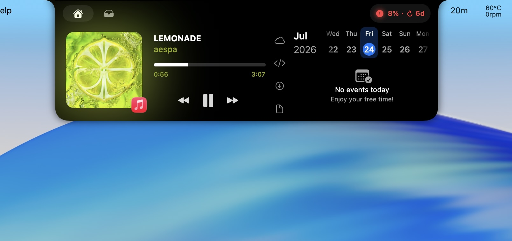

# Notch Master

Notch Master is an experimental macOS utility that turns the display notch into a compact control surface for media, calendar events, quick folders, and local Codex usage.

> [!IMPORTANT]
> This is an unofficial fork of [Boring Notch](https://github.com/TheBoredTeam/boring.notch). It is not affiliated with or endorsed by The Bored Team or OpenAI.

<p align="center">
  
</p>

<p align="center">
  <em>Media controls, quick folders, local Codex usage, and calendar in one expanded notch.</em>
</p>

## What this fork adds

- **Codex weekly usage** in the expanded notch, with Used/Remaining modes, reset countdown, and color thresholds.
- **Quick Folders** with one to four configurable shortcuts, Finder-style automatic icons, custom SF Symbols, and security-scoped bookmarks.
- **External-display gesture mode** that hides the closed black notch while retaining a subtle hover target and the full gesture interaction.
- **Notch-only interface** with no persistent menu bar icon.
- **Notch Master branding** and a fork-safe release channel.

Notch Master also retains the upstream media controls, calendar, shelf, mirror, OSD, battery, and gesture features from Boring Notch.

## Requirements

- macOS 14 Sonoma or later.
- A Mac with or without a physical notch.
- The Codex usage badge requires a working local Codex installation signed in to your account. No API key is stored by Notch Master.

## Install

1. Download `Notch-Master-v0.1.0-macOS.zip` from the [latest GitHub Release](https://github.com/PWL31/Notch-Master/releases/latest).
2. Unzip it and move **Notch Master.app** to `/Applications`.
3. Open the app.

This experimental build is ad-hoc signed rather than Apple-notarized. If macOS blocks the first launch, use **System Settings → Privacy & Security → Open Anyway**. Alternatively, after confirming that the download came from this repository, run:

```bash
xattr -dr com.apple.quarantine "/Applications/Notch Master.app"
```

Notch Master does not contain an automatic updater. New versions are distributed only through this repository's Releases page.

## Privacy

- Quick Folder permissions are stored locally as macOS security-scoped bookmarks.
- The Codex badge asks the locally installed Codex client for the signed-in account's rate-limit snapshot.
- Notch Master does not ask for or store a Codex API key.
- Camera, calendar, reminders, accessibility, and audio permissions remain optional and are used only for the corresponding visible features.

The inherited third-party media integrations and dependencies retain their own behavior and licenses.

## Build from source

1. Clone the repository:

   ```bash
   git clone https://github.com/PWL31/Notch-Master.git
   cd Notch-Master
   ```

2. Open `boringNotch.xcodeproj` in Xcode.
3. Select the `boringNotch` scheme and build the macOS app.

Swift Package Manager dependencies are resolved by Xcode. The main target and XPC helper must use matching bundle identifiers when changing the project configuration.

## Project status

`v0.1.0` is an **experimental personal-fork release**. It is usable, but it is not notarized and may change quickly. Please report reproducible bugs through [GitHub Issues](https://github.com/PWL31/Notch-Master/issues).

## License and attribution

Notch Master is distributed under the [GNU General Public License v3.0](LICENSE), the same license as Boring Notch. The complete corresponding source is available in this repository.

Original project:

- [TheBoredTeam/boring.notch](https://github.com/TheBoredTeam/boring.notch)
- Copyright and authorship remain with the original contributors.

Fork modifications:

- Maintained by [PWL31](https://github.com/PWL31).
- First public fork release: 2026-07-24.
- See [FORK_NOTICE.md](FORK_NOTICE.md) for the modification notice.

Third-party notices are retained in [THIRD_PARTY_LICENSES](THIRD_PARTY_LICENSES).
